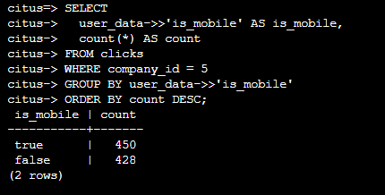
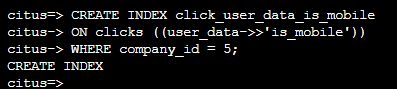
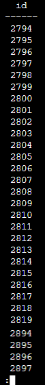

# When Data Differs Across Tenants

Each tenant may need to store unique information not needed by others. For example, one of the tenant applications using our advertising database may want to store click tracking information, whereas another tenant may want browser agents. All tenants however share a common infrastructure with an identical database schema.
Traditionally databases using a shared schema approach for multi-tenancy have resorted to creating a fixed number of pre-allocated “custom” columns, or having external “extension tables.” 

However Hyperscale(Citus) provides a much easier way with its unstructured column types, notably JSONB. JSONB (the B is for binary) provides some of the benefits of NoSQL databases and is also able to be indexed for faster queries.

In this example a tenant (say company five), uses the JSONB column to also track whether the user is on a mobile device.

## **Lab 9: Running queries when Data Differs Across Tenants**

1.In the bash console copy and paste the following to see company 5 users by mobile device.

```
SELECT
  user_data->>'is_mobile' AS is_mobile,
  count(*) AS count
FROM clicks
WHERE company_id = 5
GROUP BY user_data->>'is_mobile'
ORDER BY count DESC;
```

  
  
2.In the bash console copy and paste the following to optimize this query by creating a partial index.

```
CREATE INDEX click_user_data_is_mobile
ON clicks ((user_data->>'is_mobile'))
WHERE company_id = 5;
```

  
  
PostgreSQL supports GIN indices on JSONB columns. Creating a GIN index on a JSONB column will create an index on every key and value within that JSON document. This speeds up a number of JSONB operators such as ?, ?|, and ?&.

3.In the bash console copy and paste the following to create a GIN index.

```
CREATE INDEX click_user_data
ON clicks USING gin (user_data);

-- this speeds up queries like, "which clicks have
-- the is_mobile key present in user_data?"

SELECT id
  FROM clicks
 WHERE user_data ? 'is_mobile'
   AND company_id = 5;
 Limit 5; 
```

After running the command you will observe a table similar to one shown below:

  
  
> **Note**: If you are stuck in the results view, type q in front of **:** and press Enter to quit view mode.
  
4.Click **Next** at the bottom right of this window.
