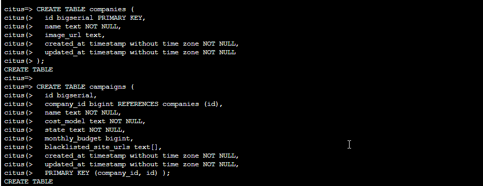
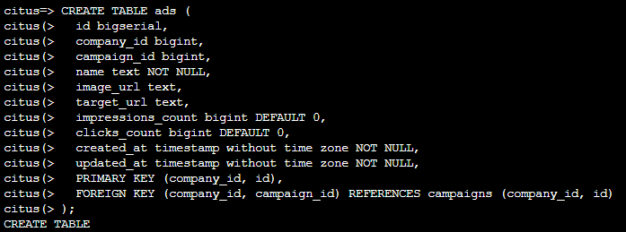
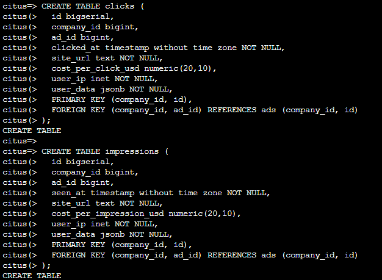
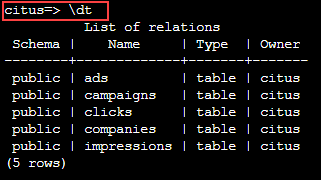

# Let's Make a Multi-Tenant App for Advertisers

We’ll build a back-end example for a multi-tenant SaaS application that enables its customers to track online advertising performance. It’s a natural fit for a multi-tenant applications because user requests for data concern one (their own) company at a time.

Let’s start by considering a simplified schema for this multi-tenant SaaS application. The application must keep track of multiple companies, each of which runs advertising campaigns. Campaigns have many ads, and each ad has associated records of its clicks and impressions.Here is the example schema.

## **Lab 4: Create a Multi-Tenant App for Advertisers**

1.In the bash console copy and paste the following CREATE TABLE commands to create a table for companies (a.k.a. tenant) and their campaigns, then press enter.

```
CREATE TABLE companies (
  id bigserial PRIMARY KEY, 
  name text NOT NULL, 
  image_url text, 
  created_at timestamp without time zone NOT NULL, 
  updated_at timestamp without time zone NOT NULL 
); 

CREATE TABLE campaigns ( 
  id bigserial, 
  company_id bigint REFERENCES companies (id), 
  name text NOT NULL, 
  cost_model text NOT NULL, 
  state text NOT NULL, 
  monthly_budget bigint, 
  blacklisted_site_urls text[], 
  created_at timestamp without time zone NOT NULL, 
  updated_at timestamp without time zone NOT NULL, 
  PRIMARY KEY (company_id, id) ); 
```

  
 
2.In the bash console copy and paste the following CREATE TABLE command to create a table for the company's ads, then press enter. 

```
CREATE TABLE ads ( 
  id bigserial, 
  company_id bigint, 
  campaign_id bigint, 
  name text NOT NULL, 
  image_url text, 
  target_url text, 
  impressions_count bigint DEFAULT 0, 
  clicks_count bigint DEFAULT 0, 
  created_at timestamp without time zone NOT NULL, 
  updated_at timestamp without time zone NOT NULL, 
  PRIMARY KEY (company_id, id), 
  FOREIGN KEY (company_id, campaign_id) REFERENCES campaigns (company_id, id) 
); 
``` 

  

3.In the bash console copy and paste the following CREATE TABLE commands to track statistics about clicks and impressions for each add, then press enter. 

```
CREATE TABLE clicks ( 
  id bigserial, 
  company_id bigint, 
  ad_id bigint, 
  clicked_at timestamp without time zone NOT NULL, 
  site_url text NOT NULL, 
  cost_per_click_usd numeric(20,10), 
  user_ip inet NOT NULL, 
  user_data jsonb NOT NULL, 
  PRIMARY KEY (company_id, id), 
  FOREIGN KEY (company_id, ad_id) REFERENCES ads (company_id, id) 
); 

CREATE TABLE impressions ( 
  id bigserial, 
  company_id bigint, 
  ad_id bigint, 
  seen_at timestamp without time zone NOT NULL, 
  site_url text NOT NULL, 
  cost_per_impression_usd numeric(20,10), 
  user_ip inet NOT NULL, 
  user_data jsonb NOT NULL, 
  PRIMARY KEY (company_id, id), 
  FOREIGN KEY (company_id, ad_id) REFERENCES ads (company_id, id) 
); 
``` 

  

4.In the bash console copy and paste the following display table commands to see the tables you have just created

```
\dt
```

  
  
Multi-tenant applications can enforce uniqueness only per tenant, which is why all primary and foreign keys include the company ID. This requirement makes enforcing these constraints much more efficient in a distributed environment as only a single node has to be checked to guarantee them.

5.Click **Next** at the bottom right of this window.
