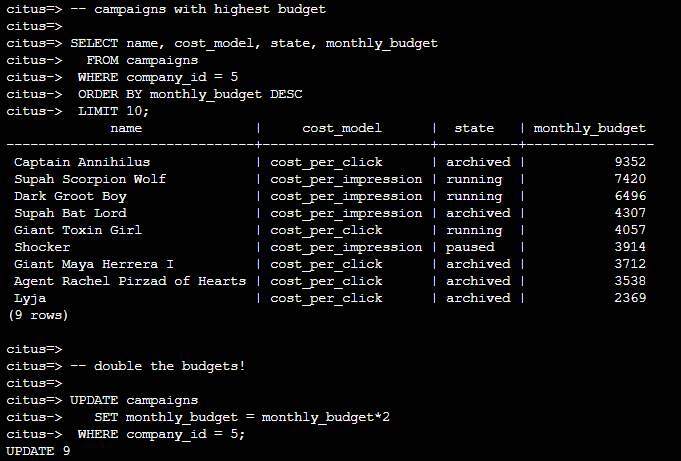
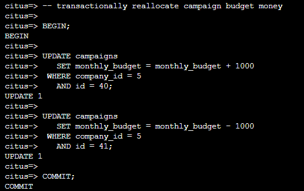
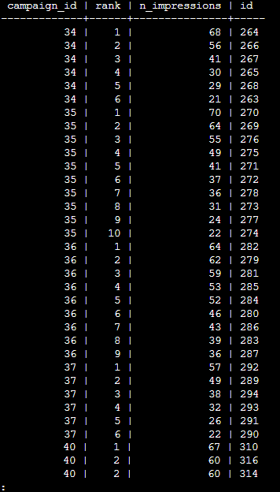

# Query tenant data

The Hyperscale (Citus) platform provides extensive SQL support. As this is a distributed system, though, you can get improved capabilities and performance by writing  application queries or update statements which include a filter on company_id or any other distribution key you may be using. As mentioned earlier, this kind of filter is common in multi-tenant apps. When using an Object-Relational Mapper (ORM) you can recognize these queries by methods such as where or filter.

When the resulting SQL executed in the database contains a WHERE company_id = value clause on every table (including tables in JOIN queries), then Hyperscale(Citus) will recognize that the query should be routed to a single node and execute it there as it is. This makes sure that all SQL functionality is available. Each node is an ordinary PostgreSQL server after all. Single tenant query for company_id = 5

When the application requests data for a single tenant, the database can execute the query on a single worker node. Single-tenant queries filter by a single tenant ID. For example, the following query filters company_id = 5 for ads and impressions.

## **Lab 6: Updating a tenant**

1.In the bash console copy and paste the following to execute a query and update on a single tenant.

```
-- campaigns with highest budget 

SELECT name, cost_model, state, monthly_budget 
  FROM campaigns 
 WHERE company_id = 5 
 ORDER BY monthly_budget DESC 
 LIMIT 10; 
 
-- double the budgets! 

UPDATE campaigns 
   SET monthly_budget = monthly_budget*2 
 WHERE company_id = 5;
```

  
  
A common pain point for users scaling applications with NoSQL databases is the lack of transactions and joins. However, transactions work as you’d expect them to in Hyperscale(Citus).

2.In the bash console copy and paste the following to execute a transactional update.

```
-- transactionally reallocate campaign budget money

BEGIN;

UPDATE campaigns
   SET monthly_budget = monthly_budget + 1000
 WHERE company_id = 5
   AND id = 40;

UPDATE campaigns
   SET monthly_budget = monthly_budget - 1000
 WHERE company_id = 5
   AND id = 41;

COMMIT;
```

  
  
As a final demo of SQL support, we have a query which includes aggregates and window functions that works the same in Hyperscale(Citus) as it does in PostgreSQL. The query ranks the ads in each campaign by the count of their impressions.

3.In the bash console copy and paste the following to execute a cross database aggregate query.

```
SELECT a.campaign_id,       
       RANK() OVER (
         PARTITION BY a.campaign_id
         ORDER BY a.campaign_id, count(*) desc
       ), count(*) as n_impressions, a.id
  FROM ads as a
  JOIN impressions as i
    ON i.company_id = a.company_id
   AND i.ad_id      = a.id
 WHERE a.company_id = 5
GROUP BY a.campaign_id, a.id
ORDER BY a.campaign_id, n_impressions desc; 
Limit 20; 
```

  

> **Note**: If you are stuck in the results view, type q in front of **:** and press Enter to quit view mode.
In short when queries are scoped to a tenant then inserts, updates, deletes, complex SQL, and transactions all work as expected.
  
4.Click **Next** at the bottom right of this window.
