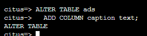

# Online Changes to the Schema

Another challenge with multi-tenant systems is keeping the schemas for all the tenants in sync. Any schema change needs to be consistently reflected across all the tenants. In Hyperscale (Citus), you can simply use standard PostgreSQL DDL (Data Definition Language) commands to change the schema of your tables, and Hyperscale (Citus) will propagate them from the coordinator node to the workers using a two-phase commit (2PC) protocol.

For example, the advertisements in this application could use a caption text column. We can add a column to the table by issuing the standard SQL on the coordinator.

## Lab 8: 

1.In the bash console copy and paste the following to add a new column.

```
ALTER TABLE ads 
  ADD COLUMN caption text; 
```

  

This updates all the workers as well. Once this command finishes, the Hyperscale (Citus) cluster will accept queries that read or write data in the new caption column.

2.	Click **Next** at the bottom right of this window.
